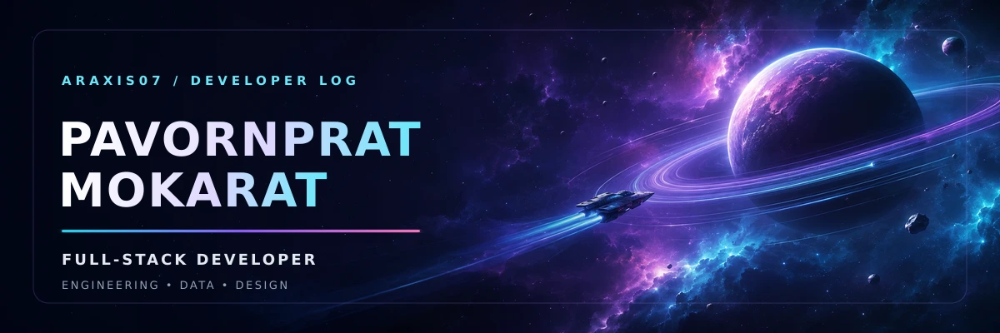
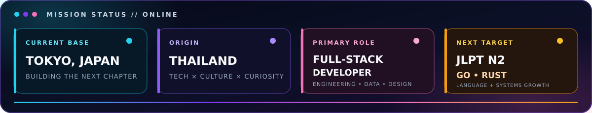
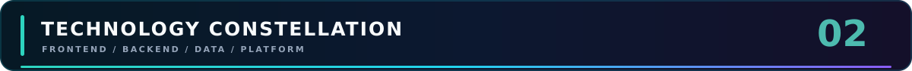
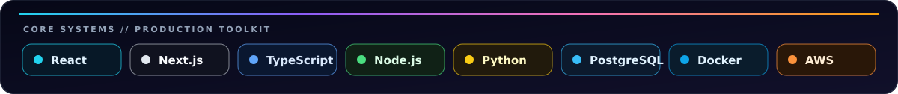
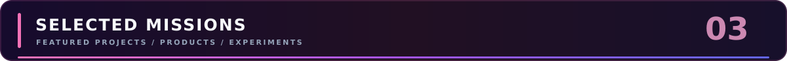
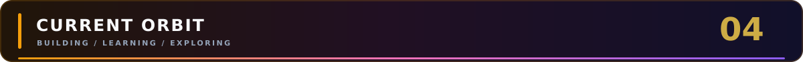

<!--
  ARAXIS07 // Developer Profile
  Deep-space palette: #030712 · #7C3AED · #22D3EE · #F472B6
-->

  

   

  

    <strong>Full-Stack Developer · Creative Technologist · Data Explorer</strong>
  

  

    From Thailand, building the next chapter of my journey in Tokyo.
  

  
  
  

 

  

 

  

Hello, I'm **Pavornprat Mokarat** — a developer who enjoys transforming complex ideas into reliable, thoughtful digital products.

I graduated from **Thai-Nichi Institute of Technology** with a B.Sc. in Information Technology and **Second-Class Honors**. My work spans frontend systems, backend APIs, dashboards, and data-rich interfaces, with a strong focus on clean architecture and maintainable code.

<table>
  <tr>
    <td width="50%" valign="top">
      <h3>📍 Current Coordinates</h3>
      

        <strong>Based in:</strong> Tokyo, Japan 
        <strong>From:</strong> Thailand 
        <strong>Role:</strong> Full-Stack Developer 
        <strong>Education:</strong> B.Sc. Information Technology
      

    </td>
    <td width="50%" valign="top">
      <h3>🎯 Active Mission</h3>
      

        Building practical full-stack products, exploring <strong>Go</strong> and <strong>Rust</strong>, and strengthening my Japanese with a long-term goal of reaching <strong>JLPT N2</strong>.
      

    </td>
  </tr>
</table>

> ✦ **Guiding principle:** Stay curious, understand the problem deeply, and build something that creates real value.

 

  

 

  

 

<table>
  <tr>
    <td width="50%" valign="top">
      <h3>⚡ Frontend Systems</h3>
      

        <code>React</code>
        <code>Next.js</code>
        <code>TypeScript</code>
        <code>JavaScript</code>
        <code>Vue</code>
        <code>Angular</code>
        <code>Tailwind CSS</code>
        <code>Material UI</code>
      

    </td>
    <td width="50%" valign="top">
      <h3>🛰 Backend Systems</h3>
      

        <code>Node.js</code>
        <code>Express</code>
        <code>NestJS</code>
        <code>FastAPI</code>
        <code>Flask</code>
        <code>REST APIs</code>
        <code>Authentication</code>
      

    </td>
  </tr>
  <tr>
    <td width="50%" valign="top">
      <h3>🪐 Data & Storage</h3>
      

        <code>PostgreSQL</code>
        <code>MySQL</code>
        <code>SQLite</code>
        <code>MongoDB</code>
        <code>NumPy</code>
        <code>TensorFlow</code>
        <code>Data Visualization</code>
      

    </td>
    <td width="50%" valign="top">
      <h3>🔭 Platform & Tools</h3>
      

        <code>Git</code>
        <code>GitHub Actions</code>
        <code>Docker</code>
        <code>AWS</code>
        <code>Linux</code>
        <code>Vercel</code>
        <code>Postman</code>
        <code>Figma</code>
      

    </td>
  </tr>
</table>

  
<strong>Additional languages and technologies</strong>

   
  <code>Python</code>
  <code>Java</code>
  <code>Go</code>
  <code>Rust</code>
  <code>C</code>
  <code>C++</code>
  <code>C#</code>
  <code>Ruby</code>
  <code>Flutter</code>
  <code>Redux</code>
  <code>Chart.js</code>
  <code>Arduino</code>
  <code>Unity</code>

 

  

<table>
  <tr>
    <td width="33%" valign="top">
      <h3>💰 <a href="https://github.com/araxis07/finance-dashboard">Finance Dashboard ↗</a></h3>
      
A scalable fintech frontend for tracking transactions and visualizing financial insights.

      
<code>Next.js</code> <code>Tailwind CSS</code> <code>Zustand</code> <code>Recharts</code>

    </td>
    <td width="33%" valign="top">
      <h3>🌸 <a href="https://github.com/araxis07/Website-Japan">Japan Travel Guide ↗</a></h3>
      
A responsive bilingual experience covering destinations across Japan's nine regions.

      
<code>Next.js</code> <code>TypeScript</code> <code>Tailwind CSS</code>

    </td>
    <td width="33%" valign="top">
      <h3>🧍 <a href="https://github.com/araxis07/Sitcam-Project">Sitcam Project ↗</a></h3>
      
A team-built posture coaching application that uses a computer camera to provide advice.

      
<code>Computer Vision</code> <code>Web App</code> <code>Team Project</code>

    </td>
  </tr>
</table>

  <a href="https://github.com/araxis07?tab=repositories"><strong>Explore all missions →</strong></a>

 

  

<table>
  <tr>
    <td width="33%" valign="top">
      <strong>🌐 BUILDING</strong>  
      Full-stack products, internal tools, dashboards, and data-rich interfaces.
    </td>
    <td width="33%" valign="top">
      <strong>⚙️ LEARNING</strong>  
      Go, Rust, scalable APIs, cloud-native workflows, and Japanese.
    </td>
    <td width="33%" valign="top">
      <strong>📈 EXPLORING</strong>  
      Software engineering, data visualization, finance, and product design.
    </td>
  </tr>
</table>

---

  <h3>「新しい経験を通して、自分の可能性を広げていきたい。」</h3>
  
<em>I want to expand my potential through new experiences.</em>

   
  <a href="mailto:pavornprat.aa@gmail.com"><strong>Start a conversation</strong></a>
  &nbsp;·&nbsp;
  <a href="https://canva.link/j33ybwperioom0j"><strong>View resume</strong></a>
  &nbsp;·&nbsp;
  <a href="https://github.com/araxis07?tab=repositories"><strong>Explore code</strong></a>
    
  ARAXIS07 // BUILDING BEYOND THE HORIZON

